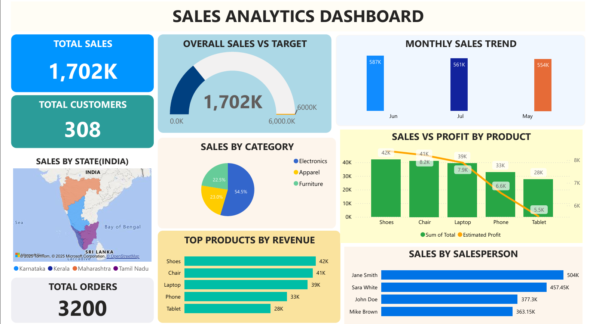
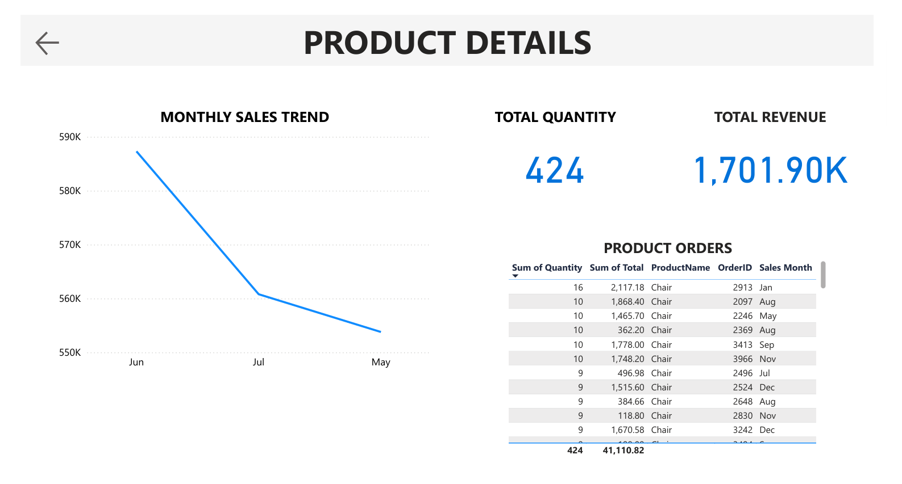

# 📊 Sales Analytics Dashboard

An interactive Power BI dashboard that analyzes sales performance using SQL as the backend.  

---

## 📌 Project Overview
This project connects a **custom SQL database** to **Power BI** to create an interactive sales analytics dashboard.  
It includes KPIs, drill-through functionality, and region/product-level insights to help make data-driven decisions.

---

## 🗂 Files in this Repository
| File Name | Description |
|-----------|-------------|
| `Sales_Analytics_Dashboard.pbix` | Full interactive Power BI dashboard (open in Power BI Desktop) |
| `Sales_Analytics_Dashboard.pdf` | Static PDF preview of the dashboard (no interactivity) |
| `SalesDashboardDB.sql` | SQL script to create and populate the Sales database |

---

## 🚀 Features Implemented
- **Key KPIs**
  - 💰 Total Revenue
  - 📦 Total Orders
  - 👥 Total Customers
  - 📊 Total Quantity Sold
- **Visuals**
  - Top Products by Revenue
  - Sales Trends Over Time (Line Chart)
  - Sales by Region (Map)
  - Category-wise Sales Distribution (Pie Chart)
  - Gauge chart for Sales vs Target
- **Interactivity**
  - Drill-through to product details
  - Back button for easy navigation
- **Product Details Page**
  - Monthly revenue trend
  - Product-wise order table
  - Total quantity sold per product

---

## 🛠 Tools & Technologies Used
- **SQL Server** – Database creation & querying
- **Power BI Desktop** – Data modeling & visualization
- **DAX** – Measures and calculated fields

---

## 📥 How to Use

### **Option 1: View the PDF (Quick Preview)**
- [📄 Click here to view PDF](./Sales_Analytics_Dashboard.pdf)

### **Option 2: Open the PBIX File**
1. Download and install [Power BI Desktop](https://powerbi.microsoft.com/desktop/).
2. Clone or download this repository.
3. Open `Sales_Analytics_Dashboard.pbix` in Power BI Desktop.

### **Option 3: Rebuild Using the SQL Script**
1. Open SQL Server Management Studio (SSMS).
2. Run `SalesDashboardDB_Part1.sql` to create and populate the database.
3. Connect Power BI to this database and apply the visuals.

---

## 📸 Dashboard Preview

### **Main Dashboard**

### **Product Details Page**

---

## 🎯 Purpose of the Project
This project was created as part of a personal portfolio to demonstrate:
- Ability to connect Power BI to a SQL database
- Data modeling, relationships, and measure creation
- Dashboard design & interactivity for business decision-making

---

## 📜 License

This project is licensed under the MIT License.  
See [`LICENSE`](LICENSE) for full details.

---

## 📧 Contact
**Author:** [Nishma P]  
**GitHub:** [https://github.com/nishmacodes]  

